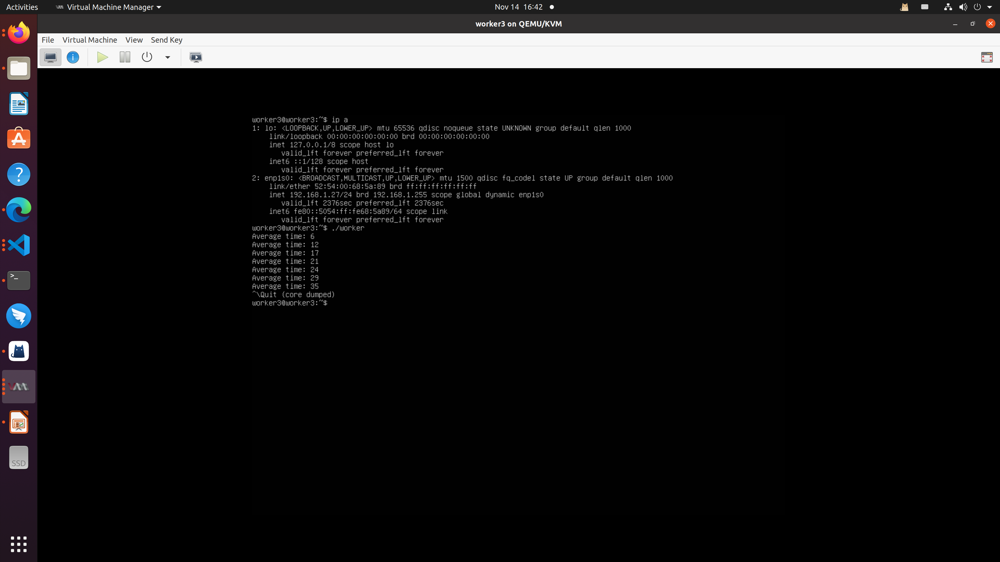

# 实验报告：基于RPC的分布式系统设计与实现
## 1. 概述

本实验旨在设计一个分布式系统，包含一个管理节点和至少3个工作节点。每个工作节点维护本地时钟，经过一定时间间隔，管理节点收集工作节点的时间，计算平均值，并将结果发送给工作节点，工作节点显示结果。
## 2. 设计与实现
### 2.1 概要设计

系统由一个客户端（管理节点）和多个服务端（工作节点）组成。管理节点通过RPC调用获取工作节点维护的时钟，由管理节点进行计算并将结果通过RPC调用发送给工作节点。
### 2.2 接口定义语言（IDL）

在IDL中定义了以下接口，其中GET_TIME用来获取工作节点的本地时钟，SET_TIME用来将计算得到的平均时钟set到工作节点中：

```
program TIMER_PROG {
    version TIME_VERS {
        long GET_TIME(void) = 1;
        void SET_TIME(long) = 2;
    } = 1;
} = 0x20000001;
```
### 2.3 RPC代码生成

使用rpcgen工具生成对应的clinet和server代码：

```
rpcgen -C timeIDL.x
```
### 2.4 管理节点实现

- 工作节点创建：
   - 在命令行中将运行工作节点IP地址作为参数，管理节点获取命令行参数中的IP地址
   - 通过clnt_create函数为每个工作节点的IP地址创建一个 RPC 客户端句柄
   - 如此可以实现一个管理节点可以管理无限的工作节点，只需要将ip指定
- 主循环：
   - 无限循环执行以下步骤：
      - 时间收集：
            对每个工作节点使用 get_time_1 RPC 函数获取时间信息。
      - 平均时间计算：
            使用 get_average_time 函数计算所有工作节点的平均时间。
      - 显示和更新：
            打印从每个工作节点接收到的时间和计算得到的平均时间。
            使用 set_time_1 RPC 函数将平均时间发送回每个工作节点。

      - 等待间隔：
            使用 sleep(INTERVAL) 等待指定的时间间隔。

### 2.5 工作节点实现
- 本地时钟维护
  -  创建了一个线程 clock_thread，用于更新本地时钟。
  - 在 update_local_clock 函数中，使用互斥锁 clock_mutex 保护了临界区，通过生成一个随机整数更新本地时钟变量 local_clock。
  - 本地时钟 local_clock 的更新使用了一个随机整数，每次更新时加上 (rand() % 10)。这样模拟了一个逐渐递增的本地时钟。

- RPC函数实现

        将实现的函数替换rpcgen生成的服务端函数
    - get_time_1_svc：返回工作节点维护的本地时钟
    - set_time_1_svc：设置工作节点的平均时间，并且输出

## 4. 实验演示
### 4.1 编译生成可执行文件

```
# generate the stubs and header files
# rpcgen -C $idl

# compile the manager program
gcc -o manager manager.c timerIDL_clnt.c 

# compile the worker program
gcc -o worker worker.c timerIDL_svc.c -lpthread
```

### 4.2 实验环境构建 

- 在实验进行的过程中，通过 QEMU 启动了三个 Ubuntu 20.04 虚拟机，每个虚拟机分别分配了独特的 IP 地址：192.168.1.24，192.168.1.26，192.168.1.27

- 首先，通过SCP将worker program复制到每个虚拟机的相应目录下。确保每个虚拟机都能够访问并执行这个程序。

- 随后，在每个虚拟机上下载并运行了 rpcbind，这是一个允许程序动态地绑定到 RPC 服务端口的工具。这是为了确保工作节点程序能够正确地注册到 RPC 服务中，并提供给管理节点使用。

- 在虚拟机准备就绪后，返回到本地机器，运行了管理节点程序 manager。通过在命令行中指定虚拟机的 IP 地址，例如'./manager 192.168.1.24 192.168.1.26 192.168.1.27'，成功地启动了管理节点，该节点可以与这三个工作节点之间进行通信。最终实验结果截图如下





        值得注意的是，如果希望使用更多的工作节点，只需将额外的 IP 地址继续添加到 manager 程序的命令行参数中。这种设计允许轻松地扩展系统，以适应不同规模和需求的分布式计算环境。通过这一流程，建立了一个具有灵活性和可扩展性的分布式系统，并成功运行了管理节点与多个工作节点之间的协作。
# 5. 总结

通过本次实验，我成功设计并实现了一个基于RPC的分布式系统，其中管理节点和工作节点通过定义的IDL接口进行RPC通信。这个系统的设计允许在需要的情况下轻松地扩展工作节点的数量，只需将新的 IP 地址添加到命令行参数中即可。通过这次实验，我深入理解了基于RPC的分布式系统的构建和管理。